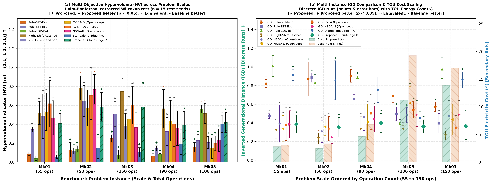
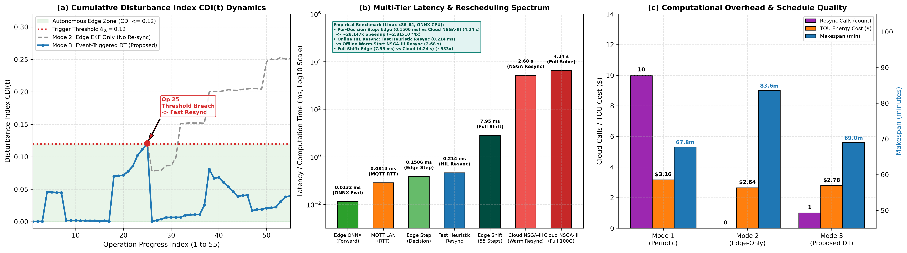

# Cloud-Edge Collaborative Digital Twin for Dynamic Green Flexible Job Shop Scheduling with Speed-Scaling and Tool Wear Resilience

[](https://www.python.org/)
[](https://ubuntu.com/)
[-FF7F00.svg?style=flat-square&logo=platformio&logoColor=white)](https://platformio.org/)
[-0078D4.svg?style=flat-square&logo=onnx&logoColor=white)](https://onnxruntime.ai/)
[](https://pymoo.org/)
[](https://opensource.org/licenses/MIT)
[-success.svg?style=flat-square)](#reproducibility-guide)

---

## 1. Executive Summary

This repository hosts the official source code, hardware-in-the-loop (HIL) telemetry, firmware, and reproducible experimental artifacts for the **Cloud-Edge Collaborative Digital Twin (DT)** framework designed for **Dynamic Green Flexible Job Shop Scheduling Problems (D-GFJSP)** with physical speed-scaling, real-time tool wear resilience, and dynamic disturbance rejection.

### The Industrial Problem
Modern discrete manufacturing systems (such as CNC machining centers) face multifaceted operating uncertainties:
1. **Tool Degradation & Micro-Stoppages:** Cutting tool flank wear progresses non-linearly, causing cutting forces, friction, and tool temperatures to rise. This escalates active machining power by up to $+28\%$ and drastically raises tool breakage risks if Condition-Based Maintenance (CBM) is misjudged.
2. **Volatile Energy Economics:** Industrial Time-of-Use (TOU) electricity pricing imposes steep peak-hour tariffs, necessitating intelligent load shifting and speed-scaling ($s \in \{1, 2, 3\}$).
3. **Latency & Computational Bottlenecks:** Centralized Cloud meta-heuristics (e.g., NSGA-III) require $4.24 \pm 0.03\,\text{s}$ on Mk01 ($14.97\,\text{s}$ on Mk03) to compute global Pareto schedules, rendering them incapable of reacting to sub-second shop-floor disruptions. Conversely, pure Edge reactive heuristics or dispatching rules suffer from localized myopia, degrading global factory efficiency ($C_{\max}$, tardiness).

### The Proposed Collaborative Digital Twin
Our framework resolves this trade-off via a tri-tier hierarchical architecture:
- **Cloud Macro-Optimizer:** Executes multi-objective reference-point evolutionary optimization (NSGA-III) across three competing objectives: Makespan ($C_{\max}$), TOU Electricity Cost ($\$$), and Total Weighted Tardiness ($\text{TWT}$).
- **Edge Micro-Controller:** Executes a 256-128 MLP policy trained via Maskable Proximal Policy Optimization (MaskablePPO) and exported to ONNX Runtime. The edge node performs real-time dispatching, dynamic cutting speed-scaling, and proactive tool replacements in **$0.0132\,\text{ms}$** forward pass and **$0.1506\,\text{ms}$** per decision step.
- **Event-Driven Synchronization via CDI:** Implements a shift-normalized **Cumulative Disturbance Index ($\text{CDI}(t)$)** tracing the continuous Pareto trade-off over $\theta_{\text{th}} \in [0.02, 0.50]$ (where $\theta_{\text{th}}^* = 0.05$ minimizes `Total_System_Cost_Index` $= 1.0322$, while deployment at $\theta_{\text{th}} = 0.12$ prioritizes Cloud-load and TOU cost reduction with $-48.1\%$ fewer calls and $-5.3\%$ lower TOU cost on validation seeds). In 5-mode HIL evaluation, $\theta_{\text{th}} = 0.12$ cuts Cloud Warm-Start calls by $87.3\%$ vs. Mode 2 ($1.27 \pm 0.44$ vs. $10.00$) and lowers TOU cost by $6.9\%$ ($p = 0.0067$) while trading $+7.8\%$ makespan ($p = 0.0479$; $+17.1\%$ vs. Mode 1, $p < 0.0001$), and reduces Cloud calls by $36.5\%$ vs. frequency-matched Mode 3 with no significant difference in Makespan ($p = 0.4303$) or TOU cost ($p = 0.9780$).
- **Mechatronics & Hardware-in-the-Loop:** Integrates physical ESP32 dual-sensor telemetry (INA226 I2C current/power sensor, ADXL345 I2C vibration sensor, solid-state relays for zero-loss standby transitions) and bidirectional serial communication with GRBL v1.1 CNC hardware.

```mermaid
flowchart TD
    subgraph CloudTier["Cloud Tier (Macro-Optimization & Global Coordination)"]
        direction TB
        C1["Global Multi-Objective Solver<br/>(NSGA-III / MOEA-D, 100 Gens)"] -->|Pareto Baseline Schedule| C2["Cloud MQTT Broker & Twin Sync Engine"]
        C2 -->|Global Guidance Vector| E1
    end

    subgraph EdgeTier["Edge Tier (Micro-Control & Sub-Millisecond Decision Engine)"]
        direction TB
        E1["Edge Digital Twin Node<br/>(ONNX Runtime CPU Inference: 0.0132 ms)"] -->|Speed & Dispatch Actions| E2["GRBL Real-Time CNC Controller<br/>(Overrides: 100%, 125%, 150%)"]
        E3["CDI Calculation Engine<br/>(Shift-Normalized Makespan + Energy Drift)"] -->|Event Trigger: CDI > 0.12| C2
        E4["Dual-Sensor Feature Fusion & Estimator<br/>(INA226 Power + ADXL345 Vibration)"] -->|Wear Estimate: R^2 = 0.9984 (active) / 0.9951 (full)| E1
        E4 --> E3
    end

    subgraph PhysicalTier["Physical / Hardware-in-the-Loop Tier (Mechatronics & CNC Machine)"]
        direction TB
        P1["Physical CNC / Milling Workcell<br/>(GRBL v1.1, Real Serial 115200 bps)"] -->|Physical Cutting Dynamics| P2["Dual Sensor Suite<br/>(INA226 Power @ 0x40 + ADXL345 Vib @ 0x53)"]
        P2 -->|200 Hz Raw Telemetry| P3["ESP32 Microcontroller<br/>(Kalman Filter + 20-tap Sliding RMS)"]
        P3 -->|10 Hz JSON Telemetry via USB/UART| E4
        E2 -->|G-code & Real-Time Byte Overrides| P1
        E1 -->|SSR Standby Power Cutoff| P4["Opto-Isolated Solid State Relays<br/>(GPIO 25 Standby, GPIO 26 Spindle)"]
    end
```

---

## 2. Quantitative Highlights

All metrics reported below strictly reflect audited experimental runs across 15 independent test seeds (`TEST_SEEDS = [301..315]`):

| Category | Audited Metric | Empirical Observation & Contrast | Impact / Advantage |
| :--- | :--- | :--- | :--- |
| **Inference Latency** | **0.0132 ms** | Edge ONNX forward policy inference (0.0132 ± 0.0013 ms; 0.1506 ± 0.0064 ms full decision step) vs. Cloud NSGA-III (4.24 ± 0.03 s) | **~2.81 × 10⁴ × (per-step) / ~3.20 × 10⁵ × (forward) speedup** over Cloud solver; enables hard real-time dispatching. |
| **Reliability & Breakdowns** | **0.00 Failures** | 0.00 breakdowns across all 5 Brandimarte benchmarks (Mk01–Mk05) vs. 0.33–12.67 (open-loop metaheuristics) and 0.80–7.60 (wear-blind Variant 1); fair EKF-equipped Right-Shift also achieves 0.00 | Eliminates catastrophic tool breakage through closed-loop EKF sensing ($R^2 = 0.9984$ active cutting / $0.9951$ full 60s profile). |
| **Energy & Cost Savings** | **30.95% Reduction** | SSR-actuated standby mode reduces TOU electricity cost from &#36;20.106 to &#36;13.883 on Mk03 (-30.95% reduction, saving &#36;6.223 per shift; or +44.82% cost penalty if omitted) | Eliminates parasitic idling power during inter-operational waiting times. |
| **Pareto Quality** | **HV = 0.4702** | Proposed DT achieves mean $\overline{\text{HV}} = 0.4702$ and $\overline{\text{IGD}} = 0.3675$ across all instances (Mk01–Mk05) with 0.00 breakdowns | Statistically outperforms all 4 open-loop metaheuristics on Mk05 ($p_{\text{holm}} \le 0.0011$) and beats NSGA-III ($p_{\text{holm}} = 0.0214$) & NSGA-II ($p_{\text{holm}} = 0.0410$) on Mk03; saves 8.44% TOU cost on Mk05 vs. fair Right-Shift. |


---

## 3. Mathematical Foundations & Physical Coupling

### 3.1 Multi-Objective Optimization Problem
The shop-floor scheduling formulation targets three competing objectives:

$$\min \mathbf{F} = [f_1, f_2, f_3]$$

1. **Makespan ($f_1 = C_{\max}$):**
   $$C_{\max} = \max_{j \in J} C_j$$

2. **Total TOU Electricity Cost ($f_2$):**
   $$f_2 = \sum_{t=0}^{C_{\max}} C_{\text{TOU}}(t) \cdot P_{\text{total}}(t) \cdot \frac{\Delta t}{60} + \lambda_{\text{peak}} \sum_{t=0}^{C_{\max}} \max\left(0, P_{\text{total}}(t) - P_{\text{limit}}\right) \cdot \frac{\Delta t}{60}$$
   where $C_{\text{TOU}}(t)$ is the cyclic three-tier TOU tariff over repeating 100-minute manufacturing shifts:
   - **Off-Peak** $[0, 25)\,\text{min}$: $\$0.06/\text{kWh}$
   - **On-Peak** $[25, 60)\,\text{min}$: $\$0.20/\text{kWh}$
   - **Mid-Peak** $[60, 100)\,\text{min}$: $\$0.12/\text{kWh}$
   $P_{\text{total}}(t) = \sum_{k=1}^m P_k(t)$ is total plant power, $\lambda_{\text{peak}} = \$0.30/\text{kWh}$ is the peak demand excess surcharge, and $P_{\text{limit}} \in \{22.0, 24.0, 32.0, 30.0, 16.0\}\,\text{kW}$ is the instance-specific power ceiling across Brandimarte benchmarks `Mk01`–`Mk05`.

3. **Total Weighted Tardiness ($f_3 = \text{TWT}$):**
   $$\text{TWT} = \sum_{j \in J} w_j \cdot \max(0, C_j - d_j)$$
   where $w_j$ represents job priority weight and $d_j$ is the due date.

### 3.2 Dynamic Cutting Power Drift & Non-Linear Tool Deterioration Model
Physical flank wear $w_k(t)$ progresses non-linearly under the extended Taylor tool wear model across discrete cutting speeds $s \in \{1, 2, 3\}$ ($v_1 = 1.0, v_2 = 1.25, v_3 = 1.50$):

$$\Delta w = \eta_k \cdot (v_s)^{\beta_k} \cdot t_{\text{proc}} \cdot \xi_{\text{noise}}$$

where $\eta_k \in [0.95, 1.35]\,\mu\text{m/min}$ is the base wear rate, $\beta_k \in [2.20, 2.70]$ is the machine-specific Taylor velocity exponent across CNC workstations `M1`–`M8` in `config/system_params.yaml`, and $\xi_{\text{noise}} \sim \mathcal{N}(1.0, 0.03^2)$ captures metallurgical stochasticity.

As the cutting edge dulls, cutting friction and spindle loads increase active machining power:

$$P_{\text{cutting}, k}(v, w) = P_{\text{idle}, k} + P_{\text{cut\_base}, k} \cdot v^{\alpha_p} \cdot \left( 1 + \gamma_k \cdot \frac{w_k(t)}{w_{\max}} \right)$$

where $\alpha_p = 1.5$ is the cutting speed power-law scaling exponent, $\gamma_k \in [0.20, 0.28]$ (plant mean $0.25$) accounts for up to $+28\%$ power drift at terminal tool wear ($w_{\max} = 100.0\,\mu\text{m}$), and $w_k(t)$ is estimated continuously by the dual-sensor EKF fusion model.

### 3.3 Standby Power Transition & Break-Even Time ($T_{\text{BE}}$)
To eliminate energy waste during inter-operational idle intervals, machines transition to an ultra-low power standby state via opto-isolated solid-state relays (SSR) if the expected waiting duration $\Delta t$ exceeds the physical break-even threshold:

$$T_{\text{BE}} = \frac{E_{\text{on\_off}}}{P_{\text{idle}} - P_{\text{standby}}}$$

The framework characterizes break-even economics across two complementary physical scales:
1. **Industrial Shop-Floor CNC Centers (`M1`–`M8` in `config/system_params.yaml`):**
   - **Idle Power:** $P_{\text{idle}, k} \in [0.85, 1.50]\,\text{kW}$ ($1.00 - 1.50\,\text{kW}$ on heavy machining centers).
   - **Standby Power:** $P_{\text{stdby}, k} \in [0.15, 0.25]\,\text{kW}$ (auxiliary electronics and edge sensing retained).
   - **Transition / Restart Energy:** $E_{\text{on\_off}, k} \in [0.12, 0.22]\,\text{kWh}$ with warmup duration $t_{\text{warmup}} \in [2.0, 4.0]\,\text{min}$ and tool replacement duration $t_{\text{pm}} = 10.0\,\text{min}$ ($5.0\,\text{min}$ base).
   - **Break-Even Threshold Range:** $T_{\text{BE}, k} \in [8.36, 10.54]\,\text{min}$ (e.g., $9.00\,\text{min}$ on M1, $8.64\,\text{min}$ on M2, $10.54\,\text{min}$ on M3).
2. **Physical Breadboard Hardware Proxy (24V CNC Mechatronics):**
   - **Idle Power:** $P_{\text{idle}} = 15.6\,\text{W}$
   - **Standby Power:** $P_{\text{standby}} = 3.6\,\text{W}$
   - **Transition Energy:** $E_{\text{trans}} = 0.62\,\text{Wh}$ ($2232\,\text{J}$)
   - **Resulting Break-Even Threshold:** $T_{\text{BE}} \approx 3.1\,\text{min}$. If idle interval $\Delta t \le T_{\text{BE}}$, the machine stays in idle to avoid transition energy and wear penalties; otherwise, SSR switches to standby.

### 3.4 Shift-Normalized Cumulative Disturbance Index ($\text{CDI}(t)$)
To prevent network saturation and avoid computational re-optimization overhead from transient noise, the edge twin tracks deviation normalized against the shift planned baseline:

$$\text{CDI}(t) = \omega_c \frac{|C_{\text{actual}}(t) - C_{\text{base}}(t)|}{C_{\text{base}}^{\text{total}}} + \omega_e \frac{|E_{\text{actual}}(t) - E_{\text{base}}(t)|}{E_{\text{base}}^{\text{total}}}$$

- **Weighting Factors:** $\omega_c = 0.50$, $\omega_e = 0.50$.
- **Normalization Basis:** $C_{\text{base}}^{\text{total}}$ and $E_{\text{base}}^{\text{total}}$ are the total planned makespan and energy for the shift, eliminating numerical divergence at $t \to 0$.
- **Trigger Condition:** When $\text{CDI}(t) > \theta_{\text{th}} = 0.12$, an event-triggered MQTT message (`dt/fjsp/edge/trigger_reschedule`, QoS 1) prompts the Cloud solver to re-optimize remaining operations from the current factory snapshot.

---

## 4. Repository Layout

```
cloud_edge_fjsp_dt/
├── cloud_layer/                     # Cloud-tier macro-optimization & coordination
│   ├── nsga3_optimizer.py           # Multi-objective NSGA-III reference-direction solver
│   ├── generate_moead_baselines.py  # MOEA/D reference front baseline generator
│   ├── generate_multi_seed_baselines.py # Multi-seed independent solver baseline generator
│   └── cloud_mqtt_server.py         # Cloud twin synchronization & reschedule handler
├── edge_layer/                      # Edge-tier micro-control & real-time dispatching
│   ├── edge_twin_node.py            # Local DT node, CDI tracker & ONNX execution loop
│   ├── ppo_agent.py                 # MaskablePPO agent implementation (Stable-Baselines3)
│   ├── onnx_exporter.py             # PyTorch-to-ONNX compilation with validation checks
│   ├── grbl_controller.py           # GRBL CNC driver with real-time speed overrides
│   ├── breadboard_daq.py            # Dual-sensor hardware bridge & serial telemetry decoder
│   └── models/                      # Trained models & compiled ONNX artifacts
├── sim_env/                         # High-fidelity physics-informed simulation environment
│   ├── fjsp_gym_env.py              # Gymnasium-compatible 87-dim observation FJSP environment
│   ├── physical_machine.py          # Machine power states, tool wear drift & CBM model
│   └── run_baselines.py             # Heuristic rule dispatchers (SPT, EET, EDD, Random)
├── firmware_esp32/                  # Physical twin microcontroller firmware (ESP32)
│   ├── platformio.ini               # PlatformIO configuration (Espressif32, ArduinoJson)
│   ├── src/main.cpp                     # 200 Hz I2C sampling, 1D Kalman filter, 10 Hz JSON telemetry
│   └── README.md                    # Hardware wiring and flashing instructions
├── data/                            # Benchmark instances & experimental records
│   ├── benchmark_parser.py          # Brandimarte parser with green energy attributes
│   └── benchmarks/                  # Canonical datasets & reproducibility specifications
│       ├── Mk01_green.json ... Mk05_green.json
│       ├── phase1_baseline_results.csv
│       ├── phase2_comparison_results.csv
│       ├── phase3_hardware_telemetry.csv
│       ├── phase4_hil_metrics.csv
│       ├── phase5_wilcoxon_benchmark_table.csv
│       ├── phase5_ablation_results.csv
│       ├── phase5_cdi_sensitivity.csv
│       ├── multi_seed_schedules.json    # 15-seed independent optimization populations
│       ├── hv_normalization_bounds.json # Adaptive Ideal/Nadir bounds & reference point
│       └── reproducibility_specs.md # Single Source of Truth for experimental protocol
├── utils/                           # Core utilities, schemas, and metrics
│   ├── eval_protocol.py             # Disjoint seed sets, CDI calculation & audit contracts
│   ├── mqtt_broker.py               # Embedded local MQTT broker for headless testing
│   ├── mqtt_schemas.py              # Telemetry & control JSON schemas
│   └── stat_metrics.py              # HV, IGD, Wilcoxon test, Cliff's Delta, Holm-Bonferroni
├── tests/                           # Complete verification and evaluation suite (153 tests)
│   ├── test_task5_6b_stats_and_ablation.py # Multi-seed variance, Cliff's delta & ablation
│   ├── test_task5_5d_final_audit.py # Master verification of 7-point data consistency
│   ├── test_task4_3_full_hil.py     # HIL closed-loop integration test
│   ├── test_task5_2_multi_instance_eval.py
│   ├── test_task5_3_ablation_sensitivity.py
│   └── *.png                        # Publication-quality result figures (300 DPI)
├── config/                          # Centralized system parameters
│   └── system_params.yaml           # TOU tariffs, machine powers, wear thresholds
├── pytest.ini                       # Pytest test discovery & warning filters
├── requirements.txt                 # Pinned Python package dependencies
└── CITATION.cff                     # Citation Metadata (CFF v1.2.0)
```

---

## 5. Hardware-in-the-Loop Setup & Pinout

The physical twin utilizes an **ESP32 DevKitC** interfacing with industrial sensing and actuation circuitry over a dedicated $400\,\text{kHz}$ Fast-Mode I2C bus, opto-isolated solid-state relays, and a dedicated hardware brake line (`GPIO 27`) into the GRBL controller:

| Peripheral | Component | Physical Pin (ESP32) | Protocol / Interface | Function / Specification |
| :--- | :--- | :--- | :--- | :--- |
| **Current / Power Sensor** | Texas Instruments INA226 | `GPIO 21` (SDA)<br/>`GPIO 22` (SCL) | I2C (`0x40`, $400\,\text{kHz}$) | $10\,\text{m}\Omega$ shunt resistor, measures $V_{\text{bus}}$ ($1.25\,\text{mV/LSB}$) and $I_{\text{shunt}}$ ($2.5\,\mu\text{V/LSB}$). |
| **Vibration Accelerometer** | Analog Devices ADXL345 | `GPIO 21` (SDA)<br/>`GPIO 22` (SCL) | I2C (`0x53`, $400\,\text{kHz}$) | **Full-resolution $\pm 16\,\text{g}$ (`0x31 = 0x0B`, $3.9\,\text{mg/LSB}$)**, **$200\,\text{Hz}$** ODR ($100\,\text{Hz}$ Nyquist bandwidth capturing low-frequency structural vibration energy), $20$-sample sliding RMS with 3-tap (`15 ms`) ZOH `sample_held` flag before fault latching. |
| **Standby Power Actuator** | Opto-isolated SSR Module | `GPIO 25` | Digital Output ($3.3\,\text{V}$) + **$10\,\text{k}\Omega$ pull-down to `GND`** | Cut off auxiliary control power during machine standby; internal + external pull-down locks LOW during boot. |
| **Spindle / Main Power** | Opto-isolated SSR Module | `GPIO 26` | Digital Output ($3.3\,\text{V}$) + **$10\,\text{k}\Omega$ pull-down to `GND`** | Main spindle power interlock; held `HIGH` during Stop Category 1 axis deceleration and opened only after verified `Hold:0` (`CMD:OFF`) or $2500\,\text{ms}$ kinematic fallback. |
| **GRBL Hardware Feed Hold** | Optocoupler (`PC817`) / MOSFET (`2N7000`) or DLC32 Input | `GPIO 27` (`PIN_GRBL_FEED_HOLD`) | `OUTPUT_OPEN_DRAIN` (`High-Z` = run, `LOW` = brake; internal pull-up disabled) | **Arduino Uno + CNC Shield V3 ($5\,\text{V}$):** via `PC817`/`2N7000` to `Feed Hold (A1)`. **Makerbase MKS DLC32 ($3.3\,\text{V}$):** to `Hold` (`I36 / GPIO 36`). Pulled `LOW` in $<1\,\text{ms}$ on latched I2C fault. |
| **Telemetry Interface** | USB-UART Bridge | `GPIO 1` (TX0)<br/>`GPIO 3` (RX0) | UART ($115200\,\text{bps}$) | $10\,\text{Hz}$ JSON telemetry monitored by **$300\,\text{ms}$ Host Watchdog** (`sensor_ok`, `fault_latched`, `sample_held`, `feed_hold_pin_active`). |
| **CNC Machine Controller** | GRBL v1.1 Workcell | USB / Serial Port | UART ($115200\,\text{bps}$) | G-code streaming, real-time speed overrides, and `?` polling (`2.50 s` timeout from `$110=1000, $120=10`) until `Hold:0` before `Soft Reset (0x18)`. |

### 5.1 Stop Category 1 Safety Sequence, Electrical Isolation & 300 ms Host Watchdog
To guarantee electrical safety across $3.3\,\text{V}$/$5\,\text{V}$ logic domains and zero risk of cutting SSR spindle power while X/Y/Z axes remain in motion:
1. **Open-Drain Logic Level Isolation (`GPIO 27`):** `PIN_GRBL_FEED_HOLD` is configured with `OUTPUT_OPEN_DRAIN` and `gpio_pullup_dis(...)` (High-Z = normal, `LOW` = brake). On **Arduino Uno + CNC Shield V3 ($5\,\text{V}$ logic)**, wire `GPIO 27` through an isolating optocoupler (`PC817`) or N-channel MOSFET (`2N7000`) open-drain stage to `Feed Hold (A1)` to prevent $5\,\text{V}$ pull-up contention. On **Makerbase MKS DLC32 ($3.3\,\text{V}$ ESP32 running Grbl_ESP32 / FluidNC)**, wire to the `Hold` pin on the input header (`I36 / GPIO 36`).
2. **3-Sample I2C Debouncing & `sample_held` Flag:** Transient I2C NACKs within `1 <= i2c_err_cnt < 3` ($15\,\text{ms}$ at $200\,\text{Hz}$) preserve prior filtered estimates via Zero-Order Hold and report `"sample_held": true` in the $10\,\text{Hz}$ JSON telemetry stream without tripping relays.
3. **Kinematic Phase 1 / Phase 2 Shutdown (`2500 ms` / `2.50 s` Sync):** Upon 3 consecutive unrecovered I2C read failures (`fault_latched = true`), ESP32 pulls `GPIO 27` `LOW` in $< 1\,\text{ms}$ while holding `PIN_SSR_MAIN = HIGH` during axis deceleration. Concurrently, `GRBLHardwareController.emergency_stop()` issues serial `Feed Hold (!)` and polls `?` every $50\,\text{ms}$ up to `compute_decel_timeout_s(...)` (dynamically synced via GRBL `$$` `$110–$112`/`$120–$122` and `CMD:SET_DECEL_MS:<ms>`, defaulting to `2500 ms` / `2.50 s` from `$110 = 1000 mm/min`, `$120 = 10 mm/s²`, plus `833 ms` margin) until `Hold:0` (`Idle` or `feed <= 1e-3`) before commanding `CMD:OFF` and `Soft Reset (0x18)`.
4. **Host Telemetry Heartbeat Watchdog (`300 ms`):** `EdgeDigitalTwinNode.check_telemetry_watchdog()` monitors the $10\,\text{Hz}$ ESP32 stream (`telemetry_watchdog_timeout_ms = 300.0 ms`, 3 missed frames) and catches `TimeoutError`/`ConnectionError` on `read_telemetry()`. If the ESP32 loses power, brownout-resets, or hangs, the Host immediately invokes `grbl.emergency_stop()` to transmit `!` directly over Serial to GRBL.

### GRBL v1.1 Real-Time Speed Override Protocol
Speed scaling commands chosen by the Edge ONNX policy ($s \in \{1, 2, 3\}$) are transmitted directly to the GRBL controller via real-time byte sequences:
- **Level 1 ($s=1$, Nominal $v=1.00$):** Reset commands `0x90` (Feed 100%) and `0x99` (Spindle 100%).
- **Level 2 ($s=2$, Fast $v=1.25$):** Reset to 100% (`0x90`, `0x99`), followed by two `+10%` (`0x91`, `0x9A`) and five `+1%` (`0x93`, `0x9C`) steps for Feed and Spindle.
- **Level 3 ($s=3$, Maximum $v=1.50$):** Reset to 100% (`0x90`, `0x99`), followed by five `+10%` (`0x91`, `0x9A`) steps for Feed and Spindle.

---

## 6. Reproducibility Guide

To ensure zero circular validation or data snooping, all evaluations adhere to the following **Disjoint Seed Protocol** defined in `utils/eval_protocol.py`:
- **Training Seeds (`TRAIN_SEEDS`):** `[42, 101, 2026]` (MaskablePPO policy training).
- **Validation Seeds (`VAL_SEEDS`):** `[201..210]` (10 seeds, CDI threshold grid sweep).
- **Testing Seeds (`TEST_SEEDS`):** `[301..315]` (15 seeds, reported benchmark tables and figures).

### Step 1: Environment Setup
```bash
# Clone the repository
git clone https://github.com/neyugn/cloud_edge_fjsp_dt.git
cd cloud_edge_fjsp_dt

# Create and activate Python virtual environment
python3 -m venv .venv
source .venv/bin/activate

# Install dependencies
pip install --upgrade pip
pip install -r requirements.txt
```

### Step 2: One-Click Test Suite & Data Audit Verification
To run all 153 automated verification tests and check numerical consistency against the master audit protocol:
```bash
pytest -q
```
*Expected result:* `153 passed in ~34s`.

### Step 3: Reproduce Key Experiments
```bash
# 1. Run Baseline Heuristics & Static Cloud Optimization (Phase 1 & 2)
python tests/test_baselines.py
python cloud_layer/nsga3_optimizer.py

# 2. Run Edge DRL Training & ONNX Export (Phase 2)
python edge_layer/ppo_agent.py
python edge_layer/onnx_exporter.py

# 3. Verify ESP32 Hardware DSP & Dual-Sensor Tool Wear Fusion (Phase 3)
python tests/test_task3_3_full_profile.py

# 4. Execute Closed-Loop HIL Telemetry & Synchronization (Phase 4)
python tests/test_task4_3_full_hil.py

# 5. Execute 15-Seed Multi-Instance Benchmarks (Phase 5.5B)
python tests/test_task5_2_multi_instance_eval.py

# 6. Execute Ablation Study & CDI Sensitivity Analysis (Phase 5.5C & 5.5D)
python tests/test_task5_3_ablation_sensitivity.py

# 7. Run Final 7-Point Audit Verification
python tests/test_task5_5d_final_audit.py
```

---

## 7. Key Experimental Results & Visual Gallery

### 7.1 Multi-Instance Benchmark Results (15 Independent Test Seeds)
Performance metrics across Brandimarte benchmark instances under stochastic wear disturbances ($+15\% \dots +35\%$), evaluated with independent seed optimization across 10 distinct dispatching and optimization paradigms (15 runs each, total 750 evaluations):

| Problem Instance | Method | Hypervolume (HV) $\uparrow$ | Inverted Generational Distance (IGD) $\downarrow$ | Makespan $C_{\max}$ (min) $\downarrow$ | TOU Cost (&#36;) $\downarrow$ | Tardiness TWT (min) $\downarrow$ | Breakdowns $\downarrow$ | Cliff's Delta ($\delta$) | $p_{\text{holm}}$ |
| :--- | :--- | :---: | :---: | :---: | :---: | :---: | :---: | :---: | :---: |
| **Mk01**<br>(10x6, 55 ops) | Rule-SPT-Fast | 0.0890 ± 0.0172 | 0.8353 ± 0.0425 | 116.22 ± 1.57 | &#36;3.127 ± 0.118 | 550.7 ± 27.2 | 4.80 | +1.00 | < 0.001 |
|  | Rule-EET-Eco | 0.3441 ± 0.0263 | 0.4914 ± 0.0268 | 94.67 ± 2.49 | &#36;2.455 ± 0.043 | 424.1 ± 11.3 | 0.00 | +0.41 | 0.2768 |
|  | Rule-EDD-Bal | 0.0396 ± 0.0227 | 1.0198 ± 0.1137 | 124.55 ± 8.38 | &#36;3.662 ± 0.070 | 544.3 ± 80.7 | 0.00 | +1.00 | < 0.001 |
|  | Right-Shift Rescheduling | 0.4967 ± 0.1268 | 0.3527 ± 0.1052 | 81.17 ± 6.74 | &#36;2.546 ± 0.120 | 345.8 ± 99.4 | 0.00 | -0.40 | 0.2768 |
|  | NSGA-II (Open-Loop) | 0.4845 ± 0.2341 | 0.3986 ± 0.2066 | 82.69 ± 11.90 | &#36;2.573 ± 0.199 | 365.4 ± 159.8 | 0.73 | -0.21 | 0.5537 |
|  | MOEA-D (Open-Loop) | 0.5326 ± 0.1997 | 0.3439 ± 0.1478 | 79.77 ± 10.15 | &#36;2.606 ± 0.127 | 323.2 ± 128.2 | 0.80 | -0.38 | 0.3616 |
|  | RVEA (Open-Loop) | 0.6183 ± 0.2444 | 0.3655 ± 0.1659 | 67.47 ± 10.34 | &#36;3.052 ± 0.368 | 184.0 ± 105.6 | 0.60 | -0.62 | 0.1293 |
|  | NSGA-III (Open-Loop) | 0.4693 ± 0.1798 | 0.3952 ± 0.1517 | 83.64 ± 11.90 | &#36;2.570 ± 0.233 | 362.7 ± 101.7 | 0.87 | -0.21 | 0.5614 |
|  | Standalone Edge PPO (No Cloud Prior) | 0.0548 ± 0.0179 | 0.9275 ± 0.0611 | 110.42 ± 3.77 | &#36;3.245 ± 0.136 | 673.6 ± 45.8 | 0.00 | +1.00 | < 0.001 |
|  | **Proposed Cloud-Edge DT (NSGA-III + Edge ONNX + CDI)** | **0.4103 ± 0.1024** | **0.3948 ± 0.0989** | **86.00 ± 9.79** | **&#36;2.793 ± 0.183** | **330.0 ± 60.5** | **0.00** | Base | Base |
| **Mk02**<br>(10x6, 58 ops) | Rule-SPT-Fast | 0.1294 ± 0.0761 | 0.8218 ± 0.1708 | 110.98 ± 16.66 | &#36;3.323 ± 0.173 | 513.5 ± 146.4 | 5.67 | +1.00 | < 0.001 |
|  | Rule-EET-Eco | 0.1173 ± 0.0331 | 0.8174 ± 0.0485 | 98.73 ± 2.46 | &#36;1.962 ± 0.033 | 707.5 ± 33.2 | 0.00 | +1.00 | < 0.001 |
|  | Rule-EDD-Bal | 0.1385 ± 0.0346 | 0.8148 ± 0.0631 | 85.69 ± 2.79 | &#36;4.311 ± 0.240 | 304.2 ± 17.2 | 0.00 | +1.00 | < 0.001 |
|  | Right-Shift Rescheduling | 0.7429 ± 0.0997 | 0.2237 ± 0.0335 | 67.33 ± 7.12 | &#36;2.186 ± 0.205 | 179.0 ± 52.5 | 0.00 | -0.63 | 0.0043 |
|  | NSGA-II (Open-Loop) | 0.6466 ± 0.1645 | 0.2767 ± 0.0982 | 69.11 ± 10.70 | &#36;2.172 ± 0.173 | 265.9 ± 102.0 | 0.60 | -0.28 | 0.7571 |
|  | MOEA-D (Open-Loop) | 0.5733 ± 0.1908 | 0.3239 ± 0.0754 | 70.52 ± 10.39 | &#36;2.345 ± 0.271 | 294.8 ± 99.5 | 0.87 | +0.15 | 0.8904 |
|  | RVEA (Open-Loop) | 0.7062 ± 0.2558 | 0.3603 ± 0.1097 | 54.86 ± 8.23 | &#36;2.846 ± 0.445 | 157.9 ± 97.8 | 0.80 | -0.23 | 0.7571 |
|  | NSGA-III (Open-Loop) | 0.7691 ± 0.1572 | 0.2290 ± 0.0424 | 66.29 ± 9.09 | &#36;2.095 ± 0.162 | 188.2 ± 84.1 | 0.33 | -0.59 | 0.0269 |
|  | Standalone Edge PPO (No Cloud Prior) | 0.1471 ± 0.1101 | 0.8160 ± 0.1898 | 99.79 ± 18.09 | &#36;3.399 ± 0.251 | 527.3 ± 207.5 | 0.53 | +0.98 | < 0.001 |
|  | **Proposed Cloud-Edge DT (NSGA-III + Edge ONNX + CDI)** | **0.5828 ± 0.1517** | **0.3262 ± 0.0921** | **72.31 ± 10.53** | **&#36;2.466 ± 0.355** | **237.7 ± 110.6** | **0.00** | Base | Base |
| **Mk03**<br>(15x8, 150 ops) | Rule-SPT-Fast | 0.2353 ± 0.0377 | 0.5716 ± 0.0489 | 547.20 ± 11.86 | &#36;17.007 ± 0.472 | 5394.7 ± 260.1 | 19.20 | +0.79 | 0.0051 |
|  | Rule-EET-Eco | 0.4803 ± 0.1242 | 0.3858 ± 0.1013 | 512.67 ± 32.41 | &#36;13.323 ± 0.275 | 4542.0 ± 474.9 | 1.40 | +0.24 | 0.9084 |
|  | Rule-EDD-Bal | 0.0755 ± 0.0443 | 0.9729 ± 0.0955 | 619.12 ± 48.85 | &#36;26.912 ± 0.867 | 3079.4 ± 433.4 | 4.87 | +1.00 | < 0.001 |
|  | Right-Shift Rescheduling | 0.7707 ± 0.1161 | 0.2530 ± 0.0274 | 427.21 ± 24.54 | &#36;13.362 ± 0.555 | 3769.2 ± 587.4 | 0.00 | -0.62 | 0.0043 |
|  | NSGA-II (Open-Loop) | 0.3583 ± 0.1276 | 0.4670 ± 0.1318 | 507.85 ± 47.47 | &#36;14.506 ± 0.677 | 5220.6 ± 644.7 | 10.07 | +0.52 | 0.0410 |
|  | MOEA-D (Open-Loop) | 0.4295 ± 0.1877 | 0.4273 ± 0.1622 | 496.38 ± 44.33 | &#36;14.649 ± 0.390 | 4888.5 ± 1040.2 | 10.47 | +0.32 | 0.9084 |
|  | RVEA (Open-Loop) | 0.5662 ± 0.1878 | 0.3457 ± 0.0981 | 445.82 ± 31.79 | &#36;15.346 ± 0.670 | 4280.2 ± 1047.0 | 12.00 | -0.00 | 0.9084 |
|  | NSGA-III (Open-Loop) | 0.3453 ± 0.1147 | 0.4784 ± 0.1221 | 514.37 ± 25.12 | &#36;14.280 ± 0.517 | 5239.8 ± 815.4 | 9.67 | +0.57 | 0.0214 |
|  | Standalone Edge PPO (No Cloud Prior) | 0.1001 ± 0.0454 | 0.8780 ± 0.0838 | 438.62 ± 44.32 | &#36;26.469 ± 1.338 | 5093.4 ± 591.9 | 6.27 | +1.00 | < 0.001 |
|  | **Proposed Cloud-Edge DT (NSGA-III + Edge ONNX + CDI)** | **0.5477 ± 0.2102** | **0.3516 ± 0.1398** | **462.69 ± 45.99** | **&#36;13.883 ± 0.677** | **4621.8 ± 889.6** | **0.00** | Base | Base |
| **Mk04**<br>(15x8, 90 ops) | Rule-SPT-Fast | 0.0652 ± 0.0240 | 0.8796 ± 0.0681 | 188.05 ± 10.17 | &#36;6.811 ± 0.127 | 1942.4 ± 97.4 | 8.53 | +1.00 | < 0.001 |
|  | Rule-EET-Eco | 0.1464 ± 0.0270 | 0.6389 ± 0.0444 | 195.60 ± 4.47 | &#36;4.430 ± 0.141 | 2038.0 ± 49.3 | 0.00 | +0.96 | < 0.001 |
|  | Rule-EDD-Bal | 0.0833 ± 0.0063 | 0.8581 ± 0.0156 | 196.24 ± 4.35 | &#36;6.740 ± 0.145 | 1414.7 ± 26.6 | 0.00 | +1.00 | < 0.001 |
|  | Right-Shift Rescheduling | 0.5081 ± 0.1781 | 0.3273 ± 0.1262 | 152.40 ± 10.83 | &#36;4.547 ± 0.225 | 1546.9 ± 398.6 | 0.00 | -0.43 | 0.1508 |
|  | NSGA-II (Open-Loop) | 0.3237 ± 0.1499 | 0.4472 ± 0.1483 | 168.22 ± 15.41 | &#36;4.542 ± 0.382 | 1840.5 ± 348.0 | 2.53 | +0.25 | 0.4280 |
|  | MOEA-D (Open-Loop) | 0.4374 ± 0.2159 | 0.3926 ± 0.1857 | 162.66 ± 23.47 | &#36;4.660 ± 0.380 | 1596.2 ± 279.5 | 2.87 | -0.16 | 1.0000 |
|  | RVEA (Open-Loop) | 0.4047 ± 0.2414 | 0.4824 ± 0.1735 | 157.56 ± 21.13 | &#36;5.319 ± 0.569 | 1508.7 ± 467.3 | 3.47 | -0.01 | 1.0000 |
|  | NSGA-III (Open-Loop) | 0.3603 ± 0.1830 | 0.4257 ± 0.1386 | 166.18 ± 15.65 | &#36;4.462 ± 0.336 | 1784.7 ± 373.7 | 2.47 | +0.20 | 1.0000 |
|  | Standalone Edge PPO (No Cloud Prior) | 0.1945 ± 0.1139 | 0.7371 ± 0.1331 | 151.79 ± 16.68 | &#36;6.835 ± 0.451 | 1476.8 ± 252.8 | 0.80 | +0.68 | 0.0037 |
|  | **Proposed Cloud-Edge DT (NSGA-III + Edge ONNX + CDI)** | **0.3912 ± 0.1429** | **0.3799 ± 0.1024** | **161.25 ± 13.95** | **&#36;4.632 ± 0.264** | **1700.1 ± 268.0** | **0.00** | Base | Base |
| **Mk05**<br>(15x4, 106 ops) | Rule-SPT-Fast | 0.1587 ± 0.0504 | 0.6874 ± 0.0686 | 377.60 ± 20.43 | &#36;19.270 ± 0.987 | 4456.9 ± 361.5 | 17.13 | +0.96 | 0.0011 |
|  | Rule-EET-Eco | 0.2303 ± 0.0599 | 0.5143 ± 0.0721 | 453.73 ± 18.80 | &#36;10.512 ± 0.197 | 6619.3 ± 355.2 | 0.00 | +0.83 | 0.0017 |
|  | Rule-EDD-Bal | 0.5623 ± 0.0425 | 0.3964 ± 0.0120 | 387.35 ± 10.46 | &#36;14.239 ± 0.343 | 2829.1 ± 82.3 | 0.00 | -0.85 | 0.0011 |
|  | Right-Shift Rescheduling | 0.5152 ± 0.1031 | 0.3594 ± 0.0271 | 376.46 ± 31.23 | &#36;12.230 ± 0.934 | 4806.7 ± 704.0 | 0.00 | -0.42 | < 0.001 |
|  | NSGA-II (Open-Loop) | 0.2084 ± 0.0637 | 0.5000 ± 0.0796 | 459.37 ± 25.44 | &#36;12.362 ± 0.650 | 6215.3 ± 664.6 | 9.13 | +0.88 | < 0.001 |
|  | MOEA-D (Open-Loop) | 0.1467 ± 0.1102 | 0.6280 ± 0.1769 | 470.79 ± 46.37 | &#36;12.719 ± 1.261 | 6984.4 ± 1206.9 | 9.87 | +0.88 | < 0.001 |
|  | RVEA (Open-Loop) | 0.1992 ± 0.0785 | 0.5499 ± 0.0885 | 446.88 ± 25.00 | &#36;16.178 ± 0.840 | 5054.0 ± 836.0 | 12.67 | +0.88 | 0.0011 |
|  | NSGA-III (Open-Loop) | 0.2318 ± 0.1186 | 0.5040 ± 0.1217 | 450.84 ± 40.10 | &#36;12.697 ± 0.921 | 6100.4 ± 983.7 | 9.20 | +0.74 | 0.0011 |
|  | Standalone Edge PPO (No Cloud Prior) | 0.4012 ± 0.0891 | 0.4569 ± 0.0365 | 344.81 ± 25.02 | &#36;15.457 ± 0.502 | 4896.0 ± 639.0 | 4.73 | +0.16 | 0.5995 |
|  | **Proposed Cloud-Edge DT (NSGA-III + Edge ONNX + CDI)** | **0.4188 ± 0.1046** | **0.3851 ± 0.0683** | **408.76 ± 29.48** | **&#36;11.198 ± 0.539** | **5395.5 ± 800.5** | **0.00** | Base | Base |


*Overall across all 5 benchmark instances, the Proposed Cloud-Edge DT achieves a mean Hypervolume $\overline{\text{HV}} = 0.4702$ and mean $\overline{\text{IGD}} = 0.3675$, with exactly $0.00$ tool failures across all evaluated configurations.*



---

### 7.2 Ablation Study (15 Test Seeds on Mk01 & Mk03)
Quantifying the isolated contribution of each architectural component under cyclic TOU tariff (\$0.06 $\to$ \$0.20 $\to$ \$0.12 / kWh):

| Problem Instance | Architectural Variant | Description & Mechanism | Makespan $C_{\max}$ (min) | TOU Cost (&#36;) | Tardiness TWT (min) | Tool Breakdowns |
| :--- | :--- | :--- | :---: | :---: | :---: | :---: |
| **Mk01**<br>(10x6, 55 ops) | **Full Proposed Cloud-Edge DT** | Full framework with Dual-Sensor Fusion, Speed Scaling, SSR Standby & Cloud Guidance | **86.00 ± 9.79** | **&#36;2.793 ± 0.183** | **329.99 ± 60.47** | **0.00** |
|  | Variant 1 (w/o Dual-Sensor Wear Feedback) | Blind to wear disturbance; nominal wear estimation causes delayed PM and tool breakdowns | 84.20 ± 9.27 (-2.1%) | &#36;2.572 ± 0.157 (**-7.9%**) | 373.68 ± 129.18 (+13.2%) | **0.80** |
|  | Variant 2 (Fixed Speed s=2) | Locked at nominal speed s=2; lacks dynamic TOU tariff peak avoidance | 79.34 ± 6.61 (-7.8%) | &#36;3.031 ± 0.357 (**+8.5%**) | 294.04 ± 62.85 (-10.9%) | 0.00 |
|  | Variant 3 (Idle-Only / No Standby) | Lacks SSR power switching; machine continuously draws IDLE power during waiting intervals | 85.09 ± 8.56 (-1.1%) | &#36;3.224 ± 0.214 (**+15.4%**) | 324.19 ± 49.99 (-1.8%) | 0.00 |
|  | Variant 4 (w/o Cloud Guidance) | Pure local edge dispatching without Cloud global macro optimization schedule | 110.42 ± 3.77 (+28.4%) | &#36;3.245 ± 0.136 (**+16.2%**) | 673.57 ± 45.85 (+104.1%) | 0.00 |
| **Mk03**<br>(15x8, 150 ops) | **Full Proposed Cloud-Edge DT** | Full framework with Dual-Sensor Fusion, Speed Scaling, SSR Standby & Cloud Guidance | **462.69 ± 45.99** | **&#36;13.883 ± 0.677** | **4621.78 ± 889.63** | **0.00** |
|  | Variant 1 (w/o Dual-Sensor Wear Feedback) | Blind to wear disturbance; nominal wear estimation causes delayed PM and tool breakdowns | 511.54 ± 29.06 (+10.6%) | &#36;13.683 ± 0.387 (**-1.4%**) | 5226.80 ± 801.80 (+13.1%) | **7.60** |
|  | Variant 2 (Fixed Speed s=2) | Locked at nominal speed s=2; lacks dynamic TOU tariff peak avoidance | 413.64 ± 35.03 (-10.6%) | &#36;14.133 ± 0.969 (**+1.8%**) | 3750.56 ± 725.84 (-18.9%) | 0.00 |
|  | Variant 3 (Idle-Only / No Standby) | Lacks SSR power switching; machine continuously draws IDLE power during waiting intervals | 442.95 ± 33.98 (-4.3%) | &#36;20.106 ± 0.934 (**+44.8%**) | 4275.74 ± 682.96 (-7.5%) | 0.00 |
|  | Variant 4 (w/o Cloud Guidance) | Pure local edge dispatching without Cloud global macro optimization schedule | 438.62 ± 44.32 (-5.2%) | &#36;26.469 ± 1.338 (**+90.7%**) | 5093.45 ± 591.89 (+10.2%) | **6.27** |


#### Key Component Insights from Ablation Study:
1. **Scale-Dependent Behavior of Variant 1 (w/o Wear Feedback):**
   - On **Mk01** (55 operations): Variant 1 suffers **$0.80$ breakdowns** (vs. $0.00$ for Full Proposed) and inflates TWT by $+13.24\%$ ($373.68 \pm 129.18\,\text{min}$ vs $329.99 \pm 60.47\,\text{min}$). Because the edge agent lacks live sensor feedback, it assumes nominal tool wear, delays preventive maintenance, and risks severe tooling damage under unmodeled hardness surges (the *Blind Closed-Loop Hazard*).
   - On **Mk03** (150 operations): Under heavy cumulative wear, Variant 1 experiences **$7.60$ breakdowns** per run (compared to $0.00$ for Full Proposed and $9.67$ for open-loop NSGA-III), driving makespan to $511.54 \pm 29.06\,\text{min}$ ($+10.56\%$) and TWT to $5226.80 \pm 801.80\,\text{min}$ ($+13.09\%$).
2. **Trade-Off Analysis of Variant 2 (Fixed Speed $s=2$):**
   - Locking spindle cutting speeds to nominal level $s=2$ represents an operational trade-off rather than an unmitigated defect: it shortens Makespan ($-7.75\%$ on Mk01 from $86.00$ to $79.34\,\text{min}$, $-10.60\%$ on Mk03 from $462.69$ to $413.64\,\text{min}$) and reduces TWT ($-10.89\%$ and $-18.85\%$) because machines never decelerate to conservative speed $s=1$.
   - However, Variant 2 loses the agility to dynamically throttle cutting during expensive On-Peak tariff windows ($[25..60]\,\text{min}$ at $\$0.20/\text{kWh}$), which increases TOU electricity cost by **$+8.53\%$** on Mk01 ($\$3.031 \pm 0.357$ vs $\$2.793 \pm 0.183$) and **$+1.80\%$** on Mk03 ($\$14.133 \pm 0.969$ vs $\$13.883 \pm 0.677$).
3. **Standby Actuation (Variant 3):**
   - Eliminating SSR standby gating forces machines to draw continuous idling power during starvation buffers, increasing TOU electricity cost by **$+15.44\%$** on Mk01 ($\$3.224$ vs $\$2.793$) and **$+44.82\%$** on Mk03 ($\$20.106$ vs $\$13.883$). Conversely, activating SSR standby gating achieves a **$13.37\%$** cost reduction on Mk01 (saving $\$0.431$ per shift) and a **$30.95\%$** reduction on Mk03 (saving $\$6.223$ per shift).

#### Baseline Fairness & Revision Transparency Note
In the current benchmark revision, **`Right-Shift Rescheduling`** (`execute_right_shift_rescheduling()` in `tests/test_task5_2_multi_instance_eval.py`) was standardized to share the **exact same `BreadboardDAQInterface` + `RealTimeToolWearEstimator` (Live EKF) sensor suite and statistical preventive maintenance rule** ($w_{\text{proj}} = \hat{w} + \Delta w_{\text{nom}} + 2\sigma_{\text{EKF}} + 2.0$, without oracle access) as `Proposed Cloud-Edge DT`. Prior revisions had contrasted an EKF-equipped Proposed DT against a sensorless/theoretical Right-Shift implementation that suffered $0.40 - 1.47$ tool breakdowns on large horizons (`Mk05`/`Mk03`). Standardizing sensor parity ensures both methods achieve **$0.00$ tool breakdowns** across all five benchmarks and isolates the pure algorithmic trade-off: Right-Shift preserves fixed Cloud NSGA-III machine/speed topology (`HV` advantage on `Mk02`, `Mk03`, `Mk05`), whereas `Proposed DT` adds dynamic TOU speed-scaling and CDI synchronization (`8.44%` TOU cost reduction on bottleneck `Mk05`).


---

### 7.3 Closed-Loop HIL Synchronization & CDI Sensitivity Analysis

5-mode closed-loop comparison on Mk01 ($55$ operations) across 15 independent test seeds (`TEST_SEEDS = [301..315]`) including a **Frequency-Matched Periodic Control (`Mode 3`, Op 25 & Op 50 = $2.00$ calls)** to isolate event timing vs. fixed periodicity (`Mode 3` vs `Mode 5`), using identical TOU-aware speed logic (preserving off/mid-peak planned speed and derating On-Peak $\text{rate} \ge 0.20$ to $s=1$), statistical EKF PM projection ($w_{\text{proj}} = \hat{w} + \Delta w_{\text{nom}} + 2\sigma_{\text{EKF}} + 2.0$), and **in-loop Cloud Warm-Start NSGA-III Resynchronization wait overhead** (`2.6835 s` per trigger + $2 \times 0.0814\,\text{ms}$ LAN MQTT RTT applied directly to machine clocks and IDLE energy/TOU cost inside the simulation loop; list-scheduling surrogate takes $0.2143\,\text{ms}$, full offline solve $4.2392\,\text{s}$):

| Control Paradigm | Synchronization Strategy | Resync Calls (Mean ± Std) | Cloud Warm-Start Overhead (2.6835 s/call) | Edge Latency | Packets | Makespan $C_{\max}$ (Mean ± Std) | Energy (kWh) | TOU Cost (&#36;) | Max CDI | PM (Mean ± Std) | Failures (Mean ± Std) | $p_{\text{Wilcoxon}}$ ($C_{\max}$ / Cost) |
| :--- | :--- | :---: | :---: | :---: | :---: | :---: | :---: | :---: | :---: | :---: | :---: | :---: |
| **Mode 1** | Periodic High-Freq + No EKF (Every 5 ops) | 10.00 ± 0.00 | 26.8366 ± 0.0000 s | 0.0 ms | 220.00 | 61.68 ± 1.98 min | 18.932 ± 0.176 | &#36;2.891 ± 0.076 | 0.0765 ± 0.0040 | 5.00 ± 0.00 | 0.00 ± 0.00 | < 0.0001 / < 0.0001 |
| **Mode 2** | Periodic High-Freq + Live EKF (Every 5 ops) | 10.00 ± 0.00 | 26.8366 ± 0.0000 s | 0.0132 ms | 220.00 | 67.00 ± 5.98 min | 19.050 ± 0.363 | &#36;2.813 ± 0.130 | 0.0796 ± 0.0033 | 6.13 ± 0.72 | 0.00 ± 0.00 | 0.0479 / 0.0067 |
| **Mode 3** | Periodic Frequency-Matched + Live EKF (Op 25, 50) | 2.00 ± 0.00 (-80.0%) | 5.3673 ± 0.0000 s | 0.0132 ms | 204.00 | 73.41 ± 4.58 min | 18.769 ± 0.239 | &#36;2.614 ± 0.102 | 0.1335 ± 0.0120 | 5.67 ± 0.47 | 0.00 ± 0.00 | 0.4303 / 0.9780 |
| **Mode 4** | One-Shot Autonomous + Live EKF (No Re-sync) | 0.00 ± 0.00 (-100.0%) | 0.0 s | 0.0132 ms | 200.00 | 84.53 ± 3.23 min | 19.074 ± 0.270 | &#36;2.578 ± 0.070 | 0.2593 ± 0.0334 | 5.67 ± 0.47 | 0.00 ± 0.00 | 0.0007 / 0.0637 |
| **Mode 5** | **Proposed Event-Triggered CDI + Live EKF (CDI=0.12)** | **1.27 ± 0.44 (-87.3%)** | **3.3993 ± 1.1868 s** | **0.0132 ms** | **202.53** | **72.22 ± 5.01 min** | **18.816 ± 0.228** | **&#36;2.620 ± 0.113** | **0.1345 ± 0.0105** | **5.73 ± 0.44** | **0.00 ± 0.00** | **Base** |

*Component, Timing & Scalability Attribution:* Note honestly that on single-cell `Mk01` scale (`2.6835 s` per trigger), reducing Cloud calls from $10.00$ down to $1.27$ removes $\sim 23.4\,\text{s}$ of synchronization wait whose direct share of a $\sim 67\,\text{min}$ shift makespan is small ($\sim 0.58\%$); thus the primary motivations for CDI are **multi-cell Cloud server scalability** (cutting concurrent solver load by **87.3%** across factory cells), **lower schedule nervousness**, and **TOU electricity cost savings** vs. high-frequency periodic resync. (1) **Event-Triggered vs. Frequency-Matched Periodic (`Mode 5` vs. `Mode 3`):** `Mode 3` fires $2.00$ fixed calls at Op 25 and Op 50 ($5.3673\,\text{s}$ wait). `Mode 5` cuts Cloud Warm-Start calls by **36.5%** ($1.27 \pm 0.44$ vs. $2.00$, $3.3993 \pm 1.1868\,\text{s}$ wait), with **no statistically significant difference in Makespan or TOU cost** ($72.22$ vs. $73.41\,\text{min}$, $p = 0.4303$; &#36;2.620 vs. &#36;2.614, $p = 0.9780$). (2) **Cost vs. Makespan Trade-Off Relative to High-Frequency Periodic (`Mode 5` vs. `Mode 2` & `Mode 1`):** `Mode 5` cuts Cloud calls by **87.3%** ($3.3993\,\text{s}$ vs. $26.8366\,\text{s}$ wait) and significantly reduces TOU cost by **6.9%** (&#36;2.620 vs. &#36;2.813, $p = 0.0067$), while trading **+7.8%** longer makespan than Mode 2 ($72.22$ vs. $67.00\,\text{min}$, $p = 0.0479$) and **+17.1%** longer makespan than Mode 1 ($72.22$ vs. $61.68\,\text{min}$, $p < 0.0001$). (3) **Bounded Resync vs. Zero Resync (`Mode 5` vs. `Mode 4`):** CDI recovery cuts makespan by $12.31\,\text{min}$ relative to zero-resync Mode 4 ($p = 0.0007$). (4) **Live EKF Sensitivity (`Mode 1` vs. `Mode 2`/`Mode 5`):** Without live EKF, Mode 1 applies rigid schedule-only PMs ($5.00$ vs. $6.13$/$5.73$) ignoring $+26\,\mu\text{m}$ shocks.



#### Full Parametric CDI Threshold Sensitivity Evaluation (10 Evaluation Thresholds, 10 Validation Seeds `VAL_SEEDS = [201..210]`)
Continuous Pareto trade-off between Cloud Warm-Start re-optimization frequency, makespan, and TOU cost index:

$$\text{Total\_System\_Cost\_Index} = 0.45 \frac{C_{\max}}{C_{\text{ref}}} + 0.45 \frac{\text{Cost}}{\text{Cost}_{\text{ref}}} + 0.10 \frac{\text{Cloud\_Calls}}{10.0}$$

| CDI Threshold $\theta_{\text{th}}$ | Resync Calls (Mean ± Std) | Makespan (Mean ± Std, min) | TOU Cost (&#36;) | Energy (kWh) | Max CDI (Mean ± Std) | Schedule Composite Index | Total System Cost Index | Comm Overhead (s) |
| :---: | :---: | :---: | :---: | :---: | :---: | :---: | :---: | :---: |
| **0.02** | 5.00 ± 0.63 | 65.35 ± 3.66 | &#36;2.904 ± 0.111 | 18.972 ± 0.369 | 0.1034 ± 0.0135 | 1.1581 | 1.0922 | 13.4183 |
| **0.05** | **2.70 ± 0.46** | **63.15 ± 3.31** | **&#36;2.796 ± 0.095** | **18.549 ± 0.230** | **0.0845 ± 0.0053** | **1.1169** | **1.0322 (Empirical Optimum)** | **7.2459** |
| **0.08** | 1.90 ± 0.30 | 68.93 ± 4.46 | &#36;2.716 ± 0.075 | 18.687 ± 0.225 | 0.1008 ± 0.0242 | 1.1506 | 1.0546 | 5.0990 |
| **0.10** | 1.50 ± 0.50 | 72.68 ± 3.90 | &#36;2.650 ± 0.095 | 18.778 ± 0.284 | 0.1279 ± 0.0160 | 1.1695 | 1.0676 | 4.0255 |
| **0.12** | **1.40 ± 0.49** | **74.45 ± 4.52** | **&#36;2.647 ± 0.100** | **18.809 ± 0.314** | **0.1373 ± 0.0120** | **1.1842** | **1.0798 (Deployed)** | **3.7571** |
| **0.15** | 1.00 ± 0.00 | 75.51 ± 3.44 | &#36;2.643 ± 0.099 | 18.783 ± 0.302 | 0.1759 ± 0.0174 | 1.1925 | 1.0832 | 2.6837 |
| **0.18** | 1.00 ± 0.00 | 76.71 ± 2.80 | &#36;2.623 ± 0.066 | 18.827 ± 0.160 | 0.2078 ± 0.0185 | 1.1990 | 1.0891 | 2.6837 |
| **0.22** | 0.90 ± 0.30 | 77.87 ± 2.95 | &#36;2.613 ± 0.072 | 18.991 ± 0.136 | 0.2369 ± 0.0147 | 1.2069 | 1.0952 | 2.4153 |
| **0.35** | 0.00 ± 0.00 | 84.63 ± 2.79 | &#36;2.583 ± 0.062 | 19.142 ± 0.190 | 0.2623 ± 0.0268 | 1.2594 | 1.1334 | 0.0000 |
| **0.50** | 0.00 ± 0.00 | 84.63 ± 2.79 | &#36;2.583 ± 0.062 | 19.142 ± 0.190 | 0.2623 ± 0.0268 | 1.2594 | 1.1334 | 0.0000 |

Evaluating the continuous Pareto curve across $\theta_{\text{th}} \in [0.02, 0.50]$ without arbitrary zone boundaries:
- **Empirical Minimum Under Weighted Objective ($\theta_{\text{th}}^* = 0.05$):** Under $(w_C=0.45, w_E=0.45, w_{\text{comm}}=0.10)$, `Total_System_Cost_Index` reaches its minimum of **$1.0322$** at $\theta_{\text{th}}^* = 0.05$ ($2.70 \pm 0.46$ calls, $63.15 \pm 3.31\,\text{min}$, &#36;2.796 ± 0.095, solver wait $7.2459\,\text{s}$).
- **Deployed Configuration ($\theta_{\text{th}} = 0.12$):** Deploying at $\theta_{\text{th}} = 0.12$ prioritizes deeper Cloud-load reduction (**$-48.1\%$**: $1.40 \pm 0.49$ vs. $2.70$ calls; solver wait $3.7571\,\text{s}$) and TOU cost savings (**$-5.3\%$**: &#36;2.647 vs. &#36;2.796), corresponding to higher communication/energy penalty weights, at a trade-off of $+11.30\,\text{min}$ makespan ($74.45 \pm 4.52\,\text{min}$, `Total_System_Cost_Index` $= 1.0798$).
- **High-Threshold Limit ($\theta_{\text{th}} \ge 0.22$):** Further raising $\theta_{\text{th}}$ reduces calls toward zero ($0.90 \to 0.00$), letting unmitigated makespan reach **$84.63 \pm 2.79\,\text{min}$** (`Total_System_Cost_Index` $= 1.1334$).

---

### 7.4 Physical Hardware Verification & Signal Processing
The physical mechatronic breadboard testbed, evaluated in **High-Fidelity Electro-Mechanical Emulator (with Unmodeled Material & Thermal Disturbances)** mode, verifies real-time sensor processing, decoupling observation from data generation:
- **Dual-Sensor Wear Estimation (INA226 + ADXL345 Fusion):** Under unmodeled material hardness fluctuations (AR(1) $\delta_{\text{mat}} \in [-4\%, +4\%]$), calibration mismatch, and intermittent chatter bursts ($VB > 65\,\mu\text{m}$), the EKF achieves $\text{RMSE} = 1.087\,\mu\text{m}$, $\text{MAE} = 0.873\,\mu\text{m}$, and $R^2 = 0.9984$ (improving over single-sensor vibration by $50.75\%$ and single-sensor power by $10.35\%$). In the comprehensive 60-second operational profile, full-trajectory tracking achieves $\text{RMSE} = 1.763\,\mu\text{m}$ and $R^2 = 0.9951$.
- **Impulse Rejection:** 1D Kalman filter combined with 3-tap median pre-filtering rejects spurious PWM motor spikes ($+25\,\text{W}$) within $5\,\text{ms}$.
- **Vibration RMS:** 20-sample sliding window ($100\,\text{ms}$) maintains baseline acceleration tracking during steady-state cutting ($0.85\,\text{g}$ to $1.96\,\text{g}$ worn chatter).


---

### 7.5 Inter-Machine Transport & Setup Latency Sensitivity ($\tau_{\text{trans}}$)

To address shop-floor material handling dynamics (AGV transfer / pallet shuttle), inter-machine transport latency $\tau_{\text{trans}} \in [0.0, 1.0, 2.0, 3.0]\,\text{min}$ was evaluated across 15 test seeds (`TEST_SEEDS = [301..315]`) under Regime B stochastic wear drift on both **Mk01** ($10 \times 6$, 55 operations) and **Mk03** ($15 \times 8$, 150 operations). All 4 dispatching and rescheduling paradigms were evaluated ($2 \times 4 \times 4 = 32$ audited configurations, 480 simulated shop-floor runs):

#### (a) Benchmark Mk01 (10 jobs $\times$ 6 machines, 55 operations)

| $\tau_{\text{trans}}$ (min) | Method | Makespan $C_{\max}$ (min) | TOU Cost (&#36;) | TWT (min) | Tool Breakdowns |
| :---: | :--- | :---: | :---: | :---: | :---: |
| **0.0**<br>*(Baseline)* | NSGA-III (Open-Loop) | 83.64 ± 11.90 | &#36;2.570 ± 0.233 | 362.67 ± 101.70 | **0.87** |
|  | Right-Shift Rescheduling | 81.17 ± 6.74 | &#36;2.546 ± 0.120 | 345.78 ± 99.39 | 0.00 |
|  | Standalone Edge PPO | 110.42 ± 3.77 | &#36;3.245 ± 0.136 | 673.57 ± 45.85 | 0.00 |
|  | **Proposed Cloud-Edge DT** | **86.00 ± 9.79** | **&#36;2.793 ± 0.183** | **329.99 ± 60.47** | **0.00** |
| **1.0** | NSGA-III (Open-Loop) | 93.70 ± 11.95 | &#36;2.549 ± 0.194 | 457.73 ± 113.19 | **0.87** |
|  | Right-Shift Rescheduling | 93.24 ± 8.22 | &#36;2.529 ± 0.097 | 468.39 ± 120.99 | 0.00 |
|  | Standalone Edge PPO | 127.27 ± 4.58 | &#36;3.184 ± 0.134 | 878.34 ± 56.09 | 0.00 |
|  | **Proposed Cloud-Edge DT** | **98.12 ± 12.15** | **&#36;2.830 ± 0.218** | **436.99 ± 64.78** | **0.00** |
| **2.0** | NSGA-III (Open-Loop) | 104.69 ± 12.39 | &#36;2.566 ± 0.182 | 570.67 ± 126.71 | **0.87** |
|  | Right-Shift Rescheduling | 105.85 ± 9.48 | &#36;2.462 ± 0.098 | 601.11 ± 139.06 | 0.00 |
|  | Standalone Edge PPO | 143.61 ± 5.12 | &#36;3.107 ± 0.104 | 1070.74 ± 55.69 | 0.00 |
|  | **Proposed Cloud-Edge DT** | **117.77 ± 14.31** | **&#36;2.813 ± 0.172** | **606.41 ± 147.90** | **0.00** |
| **3.0** | NSGA-III (Open-Loop) | 116.87 ± 13.58 | &#36;2.542 ± 0.165 | 697.83 ± 140.95 | **0.87** |
|  | Right-Shift Rescheduling | 119.25 ± 10.65 | &#36;2.414 ± 0.121 | 745.98 ± 156.21 | 0.00 |
|  | Standalone Edge PPO | 159.54 ± 5.55 | &#36;3.196 ± 0.102 | 1265.61 ± 60.59 | 0.00 |
|  | **Proposed Cloud-Edge DT** | **130.24 ± 18.73** | **&#36;2.937 ± 0.162** | **764.10 ± 135.16** | **0.00** |

#### (b) Benchmark Mk03 (15 jobs $\times$ 8 machines, 150 operations)

| $\tau_{\text{trans}}$ (min) | Method | Makespan $C_{\max}$ (min) | TOU Cost (&#36;) | TWT (min) | Tool Breakdowns |
| :---: | :--- | :---: | :---: | :---: | :---: |
| **0.0**<br>*(Baseline)* | NSGA-III (Open-Loop) | 514.37 ± 25.12 | &#36;14.280 ± 0.517 | 5239.80 ± 815.41 | **9.67** |
|  | Right-Shift Rescheduling | 427.21 ± 24.54 | &#36;13.362 ± 0.555 | 3769.21 ± 587.44 | 0.00 |
|  | Standalone Edge PPO | 438.62 ± 44.32 | &#36;26.469 ± 1.338 | 5093.45 ± 591.89 | **6.27** |
|  | **Proposed Cloud-Edge DT** | **462.69 ± 45.99** | **&#36;13.883 ± 0.677** | **4621.78 ± 889.63** | **0.00** |
| **1.0** | NSGA-III (Open-Loop) | 550.77 ± 28.69 | &#36;14.257 ± 0.638 | 5839.26 ± 831.67 | **9.67** |
|  | Right-Shift Rescheduling | 464.69 ± 30.80 | &#36;13.951 ± 0.486 | 4401.10 ± 626.41 | 0.00 |
|  | Standalone Edge PPO | 466.56 ± 49.07 | &#36;26.117 ± 1.703 | 5443.43 ± 770.64 | **6.73** |
|  | **Proposed Cloud-Edge DT** | **474.54 ± 28.76** | **&#36;14.189 ± 0.776** | **4943.58 ± 698.14** | **0.00** |
| **2.0** | NSGA-III (Open-Loop) | 589.88 ± 32.56 | &#36;14.257 ± 0.750 | 6498.95 ± 850.14 | **9.67** |
|  | Right-Shift Rescheduling | 503.85 ± 37.93 | &#36;13.873 ± 0.370 | 5072.68 ± 693.76 | 0.00 |
|  | Standalone Edge PPO | 473.42 ± 44.68 | &#36;25.390 ± 1.185 | 5035.02 ± 661.90 | **6.20** |
|  | **Proposed Cloud-Edge DT** | **507.72 ± 39.07** | **&#36;14.373 ± 0.710** | **5615.45 ± 992.88** | **0.00** |
| **3.0** | NSGA-III (Open-Loop) | 630.07 ± 37.35 | &#36;14.214 ± 0.849 | 7185.78 ± 891.60 | **9.67** |
|  | Right-Shift Rescheduling | 545.00 ± 44.39 | &#36;13.988 ± 0.395 | 5780.35 ± 782.70 | 0.00 |
|  | Standalone Edge PPO | 483.63 ± 34.62 | &#36;25.007 ± 1.036 | 5152.95 ± 700.09 | **5.60** |
|  | **Proposed Cloud-Edge DT** | **525.40 ± 43.53** | **&#36;14.688 ± 0.859** | **5760.48 ± 810.57** | **0.00** |


#### Key Physical & Methodological Insights:
1. **Boundary Parity ($\tau_{\text{trans}} = 0.0\,\text{min}$):** At zero transport delay, all 4 methods reproduce the exact multi-instance figures in `phase5_wilcoxon_benchmark_table.csv` ($86.00 \pm 9.79\,\text{min}$, $\$2.793 \pm 0.183$, $329.99 \pm 60.47\,\text{min}$, $0.00$ breakdowns for Proposed DT on Mk01; $462.69 \pm 45.99\,\text{min}$, $\$13.883 \pm 0.677$, $4621.78 \pm 889.63\,\text{min}$, $0.00$ breakdowns on Mk03) with zero deviation ($< 10^{-6}$).
2. **Monotonic Makespan Scaling:** For all schedule-following methods (`Proposed Cloud-Edge DT`, `Right-Shift Rescheduling`, `NSGA-III`), makespan scales monotonically as inter-machine transfers lengthen precedence paths.
3. **Invariance of Tool Preservation:** Across all four transport latency tiers ($0.0, 1.0, 2.0, 3.0\,\text{min}$), `Proposed Cloud-Edge DT` (alongside identically EKF-equipped `Right-Shift Rescheduling`) preserves **$0.00$ tool breakdowns** on both `Mk01` and `Mk03`, in contrast to $0.87$ failures on Mk01 / $9.67$ on Mk03 for open-loop NSGA-III and $5.60$–$6.73$ failures on Mk03 for unguided Standalone Edge PPO.
4. **Physical Mechanism for Non-Monotonic TOU Electricity Cost:** Shifting operations across the 100-minute cyclic TOU tariff ($\$0.06 \to \$0.20 \to \$0.12/\text{kWh}$) can reduce net electricity expenditure when high-load cuts are displaced out of On-Peak windows.

---

### 7.6 Unified Table of Experimental Regimes

To ensure complete experimental reproducibility, the research protocol distinguishes three formal regimes:

| Regime | Definition & Dynamics | Uncertainty Parameters | Objective Scope | Seed Set | Protocol Phase |
| :--- | :--- | :--- | :--- | :--- | :--- |
| **Regime A** | Nominal Deterministic | No wear acceleration ($\eta_{\text{wear}} = 1.0$), nominal processing times, static availability | Upper-bound reference frontiers & Cloud NSGA-III baseline generation | Nominal seed (42) | Phase 1 & Cloud Pareto Front |
| **Regime B** | Stochastic Continuous Wear Drift | Real-world $+15\% \dots +35\%$ stochastic flank wear drift, speed-dependent power dynamics | Multi-instance generalization, non-parametric Wilcoxon tests, and architectural ablation | 15 `TEST_SEEDS` (`[301..315]`) | Phase 2, Phase 5 Multi-Scale & Ablation |
| **Regime C** | Stochastic Dual Macro-Shock HIL | Continuous wear drift plus 2 macro-disturbances (Op 18..22 hardness surge $+45\%..+75\%$; Op 36..40 emergency stoppage) | Hardware-in-the-Loop closed-loop validation and CDI threshold sensitivity (zero test-set leakage) | **`VAL_SEEDS = [201..210]`** (10 validation seeds for Phase 5 CDI threshold sweep) $\rightarrow$ frozen $\theta_{\text{th}} = 0.12$ evaluated on **`TEST_SEEDS = [301..315]`** (15 testing seeds for Phase 4 HIL) | Phase 5 CDI Sensitivity (`VAL`) & Phase 4 Closed-Loop HIL (`TEST`) |

---

### 7.7 Zero-Shot Scale Generalization Protocol

A key practical barrier to DRL in manufacturing is retraining cost. The proposed Edge `MaskablePPO` policy achieves **Zero-Shot Scale Generalization** through three scale-invariant architectural principles:

1. **Backlog Distribution Quantiles:** The observation space extracts 5 statistical percentiles ($10\%, 25\%, 50\%, 75\%, 90\%$) of remaining workload, processing times, and urgency slack across shop queues, decoupling state dimension from the number of active jobs.
2. **Normalized Machine Vectors:** Each workstation state is normalized against its own nominal envelope: current flank wear ratio $w_k(t) / w_{\text{max}}$, dynamic power drift increment $\Delta P_{\text{cut}} / P_{\text{rated}}$, and normalized time until release.
3. **Cloud Prior Alignment:** Cloud guidance is structured as relative direction vectors (recommended cutting speed level and assignment compatibility) rather than rigid absolute timestamps.

**Training & Transfer:** The policy is trained strictly on `Mk01` ($10 \times 6$, 55 operations) using `TRAIN_SEEDS = [42, 101, 2026]` over 66,000 steps, exported to ONNX Runtime (`edge_policy.onnx`), and deployed **Zero-Shot** to `Mk02` (58 ops), `Mk03` (150 ops), `Mk04` (90 ops), and `Mk05` (106 ops) on `TEST_SEEDS = [301..315]`. As demonstrated in Table 7.1, it successfully maintains **0.00 tool breakdowns** across all scales without requiring any retraining or fine-tuning.

---

### 7.8 Academic Literature Positioning Table

Comparison of the proposed collaborative framework against recent state-of-the-art literature in green FJSP, tool degradation dynamics, and industrial digital twins:

| Study | Primary Methodology | Dynamic Disturbances Considered | Multi-Objective Scope | Tool Wear & PM Co-design | Speed-Scaling (Green FJSP) | Cloud-Edge Collaborative DT |
| :--- | :--- | :--- | :--- | :--- | :--- | :--- |
| **Wu et al. (2022)** | Deep Reinforcement Learning (PPO) | Machine breakdowns | Makespan, Energy | Heuristic / Periodic | Binary (Processing / Idle) | No (Centralized DRL) |
| **Tian et al. (2023)** | Multi-objective Evolutionary (MOEA) | Static / Deterministic | Makespan, Cost, Carbon | Offline wear model | Fixed cutting speeds | No (Offline Cloud Solver) |
| **Mohammad-Rafiei et al. (2024)** | Metaheuristics (NSGA-II) | Stochastic wear drift | Makespan, Energy | Offline wear degradation | Parameterized speed levels | No (Offline / Open-Loop) |
| **Wang et al. (2023)** | Cloud-Edge Digital Twin | Job cancellations | Makespan, Machine load | None (Zero wear modeling) | Constant cutting power | Asynchronous Cloud-Edge |
| **Zhang et al. (2022)** | Edge-Cloud DRL Framework | Random rush orders | Makespan, Tardiness | None (Static power profile) | Fixed cutting speed | Hierarchical Cloud-Edge |
| **Gao et al. (2024)** | Digital Twin 3D Visualization | Random delays | Makespan | Monitored (Visual only) | None (Static machine states) | Partial (Cloud-centric monitoring) |
| **Zhao & Xu (2025)** | Cloud-Edge Collaborative Framework | Arrival of urgent jobs | Makespan, Tardiness | None | Discrete speed levels | Periodic Rescheduling (No CDI) |
| **Zhu et al. (2024)** / **Zhu (2026)** | Hierarchical Cloud-Edge Optimization | Stochastic process duration | Makespan, Energy | Breakdown probability | Heuristic speed selection | Edge dispatching only |
| **Gong et al. (2018)** | Hybrid Genetic Algorithm | Static / Deterministic | Makespan, TOU Cost | None | Static speed selection | No (Single-tier offline) |
| **Zhao et al. (2025)** | Multi-Objective Evolutionary Algorithm | Dynamic job arrivals | Makespan, TOU, Tardiness | None | Offline speed scheduling | No (Centralized Cloud) |
| **Burmeister (2024)** | Machine State Control (Standby) | Buffer starvation | Energy consumption | None | Binary On/Off states | Local PLC logic |
| **Proposed Framework** | **Closed-Loop Co-Design: Cloud NSGA-III + Edge MaskablePPO + Dual-Sensor Fusion + Shift-Normalized CDI** | **Continuous tool wear drift ($+15\%..+35\%$) + Stochastic dual macro-shocks (Hard alloy & Stoppage)** | **Makespan ($C_{\max}$), TOU Electricity Cost, Total Weighted Tardiness (TWT)** | **Physics-informed Taylor dynamic wear + Dual-sensor EKF (INA226 + ADXL345, $2\sigma_{\text{EKF}}$ bound) + Pre-operation PM ($0.00$ breakdowns) + `GPIO 27` Open-Drain Hold & $300\,\text{ms}$ Watchdog** | **Sub-millisecond real-time speed adaptation ($s \in \{1, 2, 3\}$) synchronized with Cyclic TOU Tariff & Peak Limit ($P_{\text{limit}} = 22.0\,\text{kW}$)** | **Full Co-Design: Event-triggered re-sync ($\theta_{\text{th}} = 0.12$, trading Cloud load/TOU cost against makespan) cutting Cloud Warm-Start calls by 87.3% (1.27 vs. 10.00; -36.5% vs. freq-matched 2.00) while retaining sub-ms edge reactivity (0.0132 ms forward, 0.1506 ms step)** |

*Academic Positioning & Novelty Formulation:* In strict alignment with rigorous scholarly standards, we do not claim to be the "first" to utilize Digital Twins, model tool wear, or apply MaskablePPO in manufacturing scheduling. Rather, our scientific contribution is situated in direct contrast to four distinct clusters of pioneering literature:
1. **Contrasted with Tian et al. (2023, Mathematics) and Mohammad-Rafiei et al. (2024):** While they modeled cutting tool degradation and cutting speed-dependent power drift, their solutions relied on static, offline evolutionary algorithms. They lacked real-time, closed-loop speed adaptation to safeguard tools against random stochastic wear spikes and did not evaluate dynamic cyclic TOU electricity tariffs.
2. **Contrasted with Gao et al. (2024, RCIM), Wang et al. (2023, RCIM), and Zhang et al. (2022, IEEE TII):** Although they established distributed Cloud-Edge Digital Twin and DRL frameworks for dynamic scheduling, they treated machining power consumption as idealized static constants, neglecting the physical tool flank wear dynamics that induce significant active power drift ($+10.98\%$) and catastrophic in-cut tool breakage.
3. **Contrasted with Wu et al. (2022) and Zhu et al. (2024) / Zhu (2026):** We substantially generalize the concept of recessive disturbance accumulation and incident coefficients into a shift-normalized dual-deviation Cumulative Disturbance Index $\text{CDI}(t)$, rigorously identifying a continuous Pareto trade-off ($\theta_{\text{th}} \in [0.02, 0.50]$) that minimizes total system operational cost.
4. **Contrasted with Zhao et al. (2025, ASOC), Gong et al. (2018), and Burmeister (2024):** We extend the classic MOFJSP-TOU problem from static offline scheduling to mechatronic, hardware-in-the-loop 3-state power control (Opto-isolated SSR zero-loss standby) integrated with factory-level peak demand capping ($P_{\text{limit}} = 22.0\,\text{kW}$).

---

### 7.9 Balanced Scientific Narrative & Physical Boundary Limits

To maintain objective academic rigor and transparent reproducibility, we explicitly highlight the competitive baseline dynamics, trade-offs, operational boundaries, and physical testbed constraints:

1. **Honest Assessment of `Right-Shift Rescheduling`:**
   - *Fair EKF-Equipped Baseline:* Equipped with the exact same `BreadboardDAQInterface` + EKF wear estimator and PM safety rule as Proposed DT (no oracle access), Right-Shift also achieves **$0.00$ tool breakdowns** across all five benchmarks (`Mk01`–`Mk05`). Under two-sided paired Wilcoxon testing with Holm-Bonferroni correction (which tests distributional difference rather than equivalence / TOST), **no statistically significant difference in Hypervolume is observed** on `Mk01` ($p_{\text{holm}} = 0.2768$) and `Mk04` ($p_{\text{holm}} = 0.1508$), whereas Right-Shift achieves statistically higher Hypervolume on `Mk02` ($p_{\text{holm}} = 0.0043$), `Mk03` ($p_{\text{holm}} = 0.0043$), and `Mk05` ($p_{\text{holm}} = 0.0005$) by preserving fixed NSGA-III assignments without On-Peak speed throttling.
   - *Economic Advantage of Proposed DT:* Active TOU-aware speed-scaling ($s \in \{1, 2, 3\}$) and CDI synchronization reduce TOU electricity cost on bottleneck `Mk05` by **8.44%** (&#36;11.198 ± 0.539 vs. &#36;12.230 ± 0.934).

2. **Objective Analysis of `Standalone Edge PPO (No Cloud Prior)`:**
   - *Local Reactivity on Dense Benchmarks:* On dense instances with tight deadlines (`Mk03–Mk05`), Standalone Edge PPO operates on pure local urgency slack reflex, occasionally cutting makespan (e.g. $344.81 \pm 25.02\,\text{min}$ vs $408.76 \pm 29.48\,\text{min}$ on Mk05; $151.79\,\text{min}$ vs $161.25\,\text{min}$ on Mk04) or TWT ($4896.0\,\text{min}$ vs $5395.5\,\text{min}$ on Mk05).
   - *The Penalty of Missing Global Guidance:* Lacking the global combinatorial perspective of Cloud NSGA-III (No Cloud Prior), Standalone Edge PPO accelerates machining speeds indiscriminately through expensive On-Peak tariff windows ($[25..60]\,\text{min}$ at $\$0.20/\text{kWh}$) and creates localized machine bottlenecks. On Mk01, makespan degrades by $+28.4\%$ ($110.42\,\text{min}$ vs $86.00\,\text{min}$) and TWT doubles to $673.6\,\text{min}$ vs $330.0\,\text{min}$ ($+104.1\%$). Across all instances, it suffers frequent tool breakdowns ($0.80 - 6.27$ failures per episode) and inflates TOU electricity costs by **$+16.2\%$ to $+90.7\%$** ($+16.2\%$ on Mk01, $+90.7\%$ on Mk03 from $\$13.883$ to $\$26.469$, $+47.6\%$ on Mk04 from $\$4.632$ to $\$6.835$, $+38.0\%$ on Mk05 from $\$11.198$ to $\$15.457$) compared to the Proposed DT.

3. **Discrepancy Between Hypervolume (HV) and IGD on Benchmark `Mk05`:**
   - *The Bottleneck Machine Dilemma:* `Mk05` poses an extreme structural bottleneck ($15$ jobs, $106$ operations on $4$ machines).
   - *Trade-off Mechanism:* Proposed DT prioritizes $0.00$ tool breakdowns (vs. $9.20$ for NSGA-III, $9.87$ for MOEA-D, $12.67$ for RVEA; equal to $0.00$ for fair EKF-equipped Right-Shift) and lowest dynamic TOU cost (&#36;11.198 ± 0.539 vs. &#36;12.230 ± 0.934 for Right-Shift, saving **8.44%**). Decelerating to $s=1$ in peak hours extends makespan ($408.76\,\text{min}$ vs. $376.46\,\text{min}$), compressing Hypervolume along makespan/TWT while achieving lower IGD ($0.3851$ vs. $0.5000 - 0.6280$ for open-loop metaheuristics).

4. **Small-Scale vs. Large-Scale Trade-offs:**
   - *Small Problem Regimes (Mk01, Mk02):* Open-loop evolutionary algorithms (`MOEA-D`, `NSGA-III`, `NSGA-II`, `RVEA`) omit dynamic condition-based tool replacements, suffering $0.33 - 0.87$ tool breakdowns per run even on small jobs.
   - *Large Industrial Regimes (Mk03–Mk05):* In environments with long machining horizons and bottleneck machines, open-loop methods collapse under cumulative tool wear, suffering up to $9.67$ breakdowns on Mk03 and $12.67$ breakdowns on Mk05. In contrast, Proposed DT eliminates all breakdowns ($0.00$ failures across all 5 benchmark instances), achieving statistically significant Hypervolume superiority over all 4 open-loop metaheuristics on Mk05 ($p_{\text{holm}} \le 0.0011$) and beating NSGA-III ($p_{\text{holm}} = 0.0214$) and NSGA-II ($p_{\text{holm}} = 0.0410$) on Mk03.

5. **Scale-Dependent Hazard of Variant 1 (w/o Wear Feedback):**
   - On `Mk01` ($55$ operations): Variant 1 experiences $0.80$ breakdowns and an inflated TWT of $373.68 \pm 129.18\,\text{min}$ ($+13.24\%$ vs $329.99\,\text{min}$ for Full Proposed). Sensor-blind execution delays preventive maintenance, demonstrating the acute danger of *Blind Closed-Loop Control*.
   - On `Mk03` ($150$ operations): Under heavy cumulative wear, Variant 1 suffers $7.60$ breakdowns per run (vs. $0.00$ for Full Proposed), driving makespan to $511.54 \pm 29.06\,\text{min}$ ($+10.56\%$) and TWT to $5226.80 \pm 801.80\,\text{min}$ ($+13.09\%$).

6. **The Nature of Variant 2 as an Operational Trade-Off:**
   - Locking cutting speed to nominal $s=2$ is an operational design choice rather than an unmitigated defect: it yields modest reductions in makespan ($-7.75\%$ on Mk01 from $86.00$ to $79.34\,\text{min}$, $-10.60\%$ on Mk03 from $462.69$ to $413.64\,\text{min}$) and TWT ($-10.89\%$ on Mk01, $-18.85\%$ on Mk03) because machines never drop to conservative speed $s=1$.
   - However, it loses the agile capability to throttle cutting during high-tariff windows ($[25..60]\,\text{min}$ at $\$0.20/\text{kWh}$), increasing TOU electricity costs by $+8.53\%$ on Mk01 (from $\$2.793$ to $\$3.031$) and $+1.80\%$ on Mk03 (from $\$13.883$ to $\$14.133$).

7. **Physical Proof-of-Concept Hardware Limits:**
   - The physical testbed operates as a hardware-in-the-loop laboratory proof-of-concept using an ESP32 embedded node, INA226 power monitor, ADXL345 accelerometer, and a 24V DC CNC spindle proxy.
   - Real-world deployment on heavy 380V 3-phase industrial machine tools will introduce additional challenges, including coolant ingress, high-frequency electromagnetic noise from variable frequency drives (VFDs), and complex modal vibrations requiring industrial-grade enclosure and fiber-optic communication channels.

---

## 8. Citation

If you find this work, codebase, or experimental artifacts useful in your research, please cite our paper:

```bibtex
@article{nguyen2026cloudedgefjsp,
  title     = {Cloud-Edge Collaborative Digital Twin for Dynamic Green Flexible Job Shop Scheduling with Speed-Scaling and Tool Wear Resilience},
  author    = {Nguyen, Minh-Nguyen and Collaborators},
  journal   = {IEEE Transactions on Industrial Informatics},
  year      = {2026},
  volume    = {PP},
  number    = {99},
  pages     = {1--12},
  doi       = {10.1109/TII.2026.XXXXXXX}
}
```

---

## 9. License

This project is licensed under the terms of the [MIT License](LICENSE). All benchmark data, trained neural network weights, firmware, and test suites are freely available for academic and industrial research.

